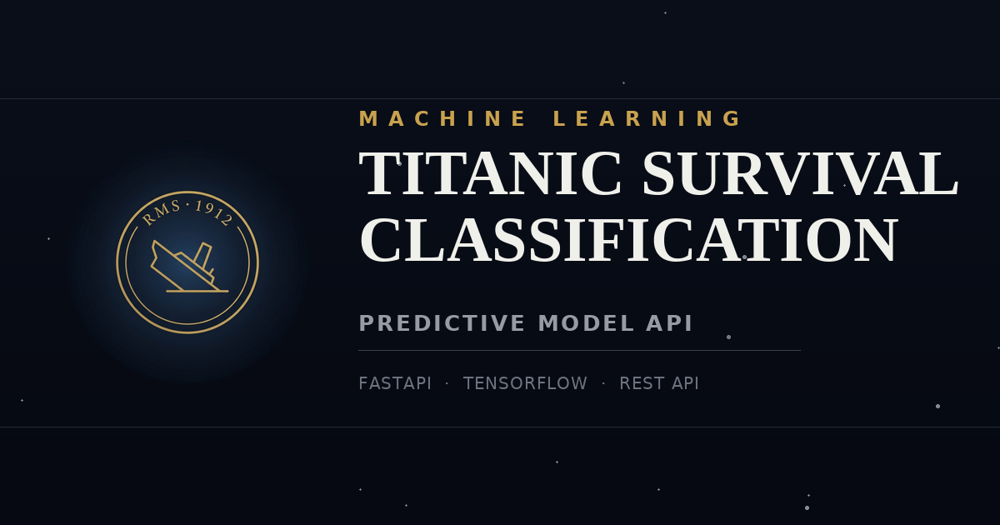

<div align="center">




**The AI engine predicting passenger survival on the RMS Titanic using a trained deep learning model, served through a production-ready REST API.**

</div>

---

## 📋 Overview

This is a production-ready REST API built with **FastAPI** that predicts passenger survival on the Titanic using a trained **TensorFlow/Keras** neural network.

Given passenger details (age, fare, class, family info, etc.), the service returns a survival prediction for each passenger — making it easy to plug a trained ML model into any downstream application, dashboard, or analytics pipeline.

### ✨ Key Features

- ⚡ **Fast inference** — model and preprocessor are loaded once at startup, not per request
- 📦 **Batch predictions** — classify a single passenger or an entire list in one call
- 🧩 **Clean architecture** — clear separation between config, inference logic, and request/response schemas
- 🔒 **Environment-based configuration** via `.env`
- 📖 **Auto-generated interactive docs** (Swagger UI & ReDoc) out of the box
- 🛡️ **Robust error handling** with descriptive HTTP error responses


--- 
---

> ⚠️ **Security note:** the `X-API-Key` below is a **demo key** shared for evaluation purposes only. If this repository is public, rotate the key (set a new `SECRET_KEY_TOKEN` in your Hugging Face Space secrets) so this value stops working. Never rely on a key that has appeared in a public README for anything beyond a quick demo.

```
Demo X-API-Key: c0c2d9d05029aed5d5174ff5ff8e6d88
```


> ⚠️ **Security note:** the `X-API-Key` below is a **demo key** shared for evaluation purposes only. If this repository is public, rotate the key (set a new `SECRET_KEY_TOKEN` in your Hugging Face Space secrets) so this value stops working. Never rely on a key that has appeared in a public README for anything beyond a quick demo.

```
Demo X-API-Key: c0c2d9d05029aed5d5174ff5ff8e6d88
```

---


## 🏗️ Project Structure

```
.
├── .env                        # Environment variables (not committed)
├── .env.example                # Environment variables template
├── .gitignore
├── main.py                     # FastAPI application entry point
├── README.md
├── requirements.txt
│
└── src/
    ├── __init__.py
    │
    ├── artifacts/
    │   ├── best_model.keras    # Trained Keras model
    │   └── preprocessor.joblib # Fitted preprocessing pipeline
    │
    ├── notebooks/
    │   └── notebook.ipynb      # Model training & experimentation
    │
    └── utils/
        ├── config.py           # App config, model & preprocessor loading
        ├── inference.py         # Prediction logic
        ├── requests.py          # Pydantic request schemas
        ├── response.py          # Pydantic response schemas
        └── __init__.py
```

## ⚙️ Requirements

- Python 3.12+
- pip

### Dependencies

```
uvicorn==0.51.0
fastapi==0.139.2
tensorflow==2.21.0
pydantic==2.13.4
joblib==1.5.3
python-dotenv==1.2.2
python-multipart==0.0.32
```

## 🚀 Getting Started

### 1. Clone the repository

```bash
git clone <repository-url>
cd <repository-folder>
```

### 2. Create a virtual environment

```bash
python -m venv venv
# Windows
venv\Scripts\activate
# macOS/Linux
source venv/bin/activate
```

### 3. Install dependencies

```bash
pip install -r requirements.txt
```

### 4. Configure environment variables

Copy `.env.example` to `.env` and fill in the values:

```bash
cp .env.example .env
```

```env
APP_NAME="Titanic-Survived-Classification"
VERSION="1.0"
API_SECRET_KEY=your-secret-key-here
```

### 5. Run the API

```bash
uvicorn main:app --reload
```

The API will be available at **http://127.0.0.1:8000**

Interactive API docs (Swagger UI): **http://127.0.0.1:8000/docs**
Alternative docs (ReDoc): **http://127.0.0.1:8000/redoc**

## 📡 API Endpoints

### `GET /`

Health check endpoint.

**Response**
```json
{
  "message": "Up & Running"
}
```

### `POST /classify`

Predicts survival for a list of passengers.

**Request Body**

```json
[
  {
    "passenger_id": 1,
    "age": 22.0,
    "fare": 7.25,
    "sex": "female",
    "embarked": "S",
    "parch": 0,
    "sibsp": 1,
    "pclass": 3
  },

  {
    "passenger_id": 2,
    "age": 12.0,
    "fare": 8.2,
    "sex": "male",
    "embarked": "Q",
    "parch": 3,
    "sibsp": 2,
    "pclass": 3
  }
]
```

| Field          | Type    | Description                                  |
|----------------|---------|-----------------------------------------------|
| `passenger_id` | int     | Unique passenger identifier                   |
| `age`          | float   | Passenger age                                 |
| `fare`         | float   | Ticket fare                                   |
| `sex`          | string  | `male` or `female`                            |
| `embarked`     | string  | Port of embarkation: `S`, `C`, or `Q`         |
| `parch`        | int     | Number of parents/children aboard             |
| `sibsp`        | int     | Number of siblings/spouses aboard             |
| `pclass`       | int     | Passenger class (1, 2, or 3)                  |

**Response**

```json
{
  "predictions": [
    {
      "passenger_id": 1,
      "predicted": "Survived"
    },
    {
      "passenger_id": 2,
      "predicted": "Not Survived"
    }
  ]
}
```

## 🧠 Model

The model is a neural network trained on the classic Titanic dataset (see `src/notebooks/notebook.ipynb` for the full training pipeline, including feature engineering and preprocessing).

**Engineered features:**

- **family_size** — total family members aboard (`parch + sibsp + 1`)
- **is_alone** — whether the passenger was traveling alone

**Pipeline:**

1. Raw passenger data is validated with Pydantic schemas
2. Features are engineered and transformed using the fitted `preprocessor.joblib`
3. The transformed features are fed into `best_model.keras` for inference
4. Predictions are mapped back to human-readable labels (`Survived` / `Not Survived`)

The fitted preprocessing pipeline (`preprocessor.joblib`) and trained model (`best_model.keras`) are loaded once at startup for fast inference.

## 🛡️ Error Handling

Any failure during inference returns an HTTP `500` response with details:

```json
{
  "detail": "Error making predictions: <error message>"
}
```
<<<<<<< HEAD
=======

## 🗺️ Roadmap

- [ ] Add model versioning & A/B testing support
- [ ] Add authentication middleware using `API_SECRET_KEY`
- [ ] Add request/response logging & monitoring
- [ ] Containerize with Docker for easier deployment
- [ ] Add unit & integration tests

## 📄 License

This project is provided as-is for educational and demonstration purposes.
>>>>>>> 53c0934 (update all project)
